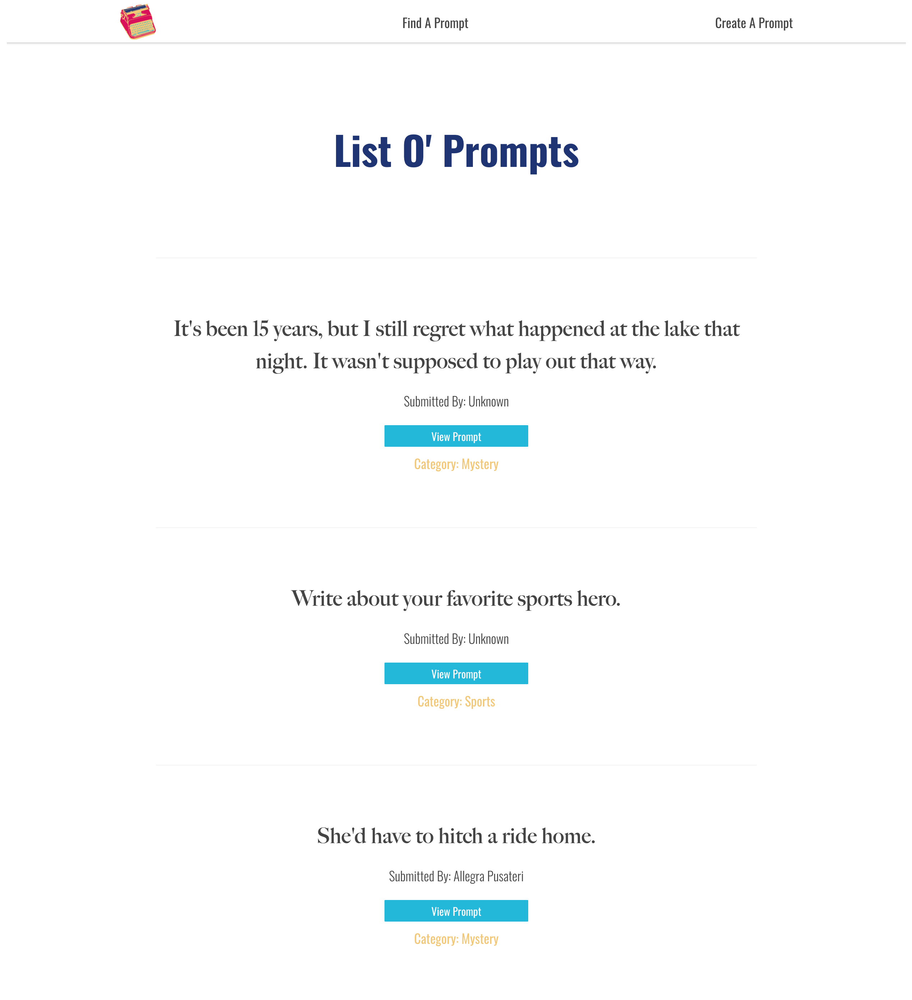
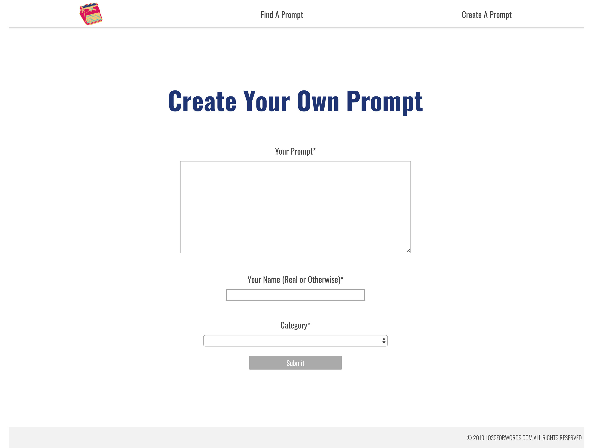

# Loss For Words App

A community creative writing prop application. Users can find prompts that inspire them, comment with their own words, and submit new prompts for other people to respond to. 

## Motivation

Writers block is a very common thing, whether you simply write on occasion or professionally. I wanted to provide inspiration that is practical, fun to use, and engages users in a conversation.

## Screenshots
Home Screen:


Prompt List:



Individual Prompt:


Add Prompt:



## Running Tests

To run tests, run
```
npm test
```

## Built With

### Front-End
* React
* React-Router

### Testing
* Jest

## Features

* Create a prompt
* Comment on prompts
* See every prompt currently available

## Demo

- [Live Demo](https://loss-for-words-app.legsateri.now.sh/)

## Server

- [Server Repo](https://github.com/legsateri/loss-for-words-api)
